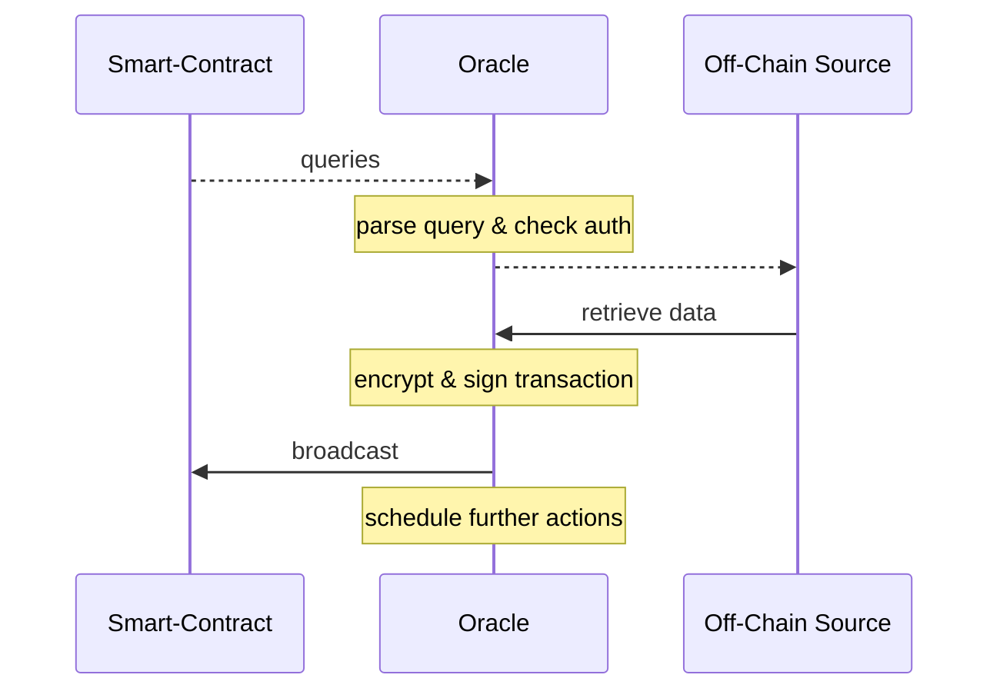
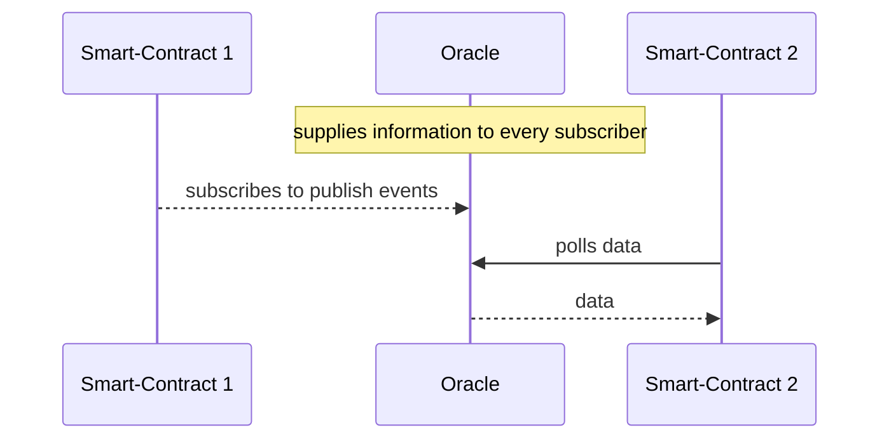
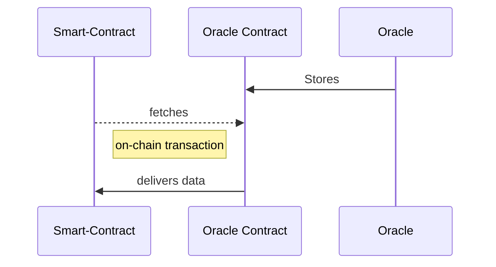

# 🌳 Design Pattern

### Request-response

- data space to huge to be stored in smart-contract
- users only need small data subset at a time
- off-chain infrastructure monitors on-chain smart-contract calls
- common in client-server architectures
- allows for two-way communication

<v-click>

*e.g. synchronize interest rate of a smart bond daily*

</v-click>

::right::

---
layout: two-cols
---

# 🌳 Design Pattern

### Publish-subscribe
- effectively provides data broadcast service
  - *think of a RSS feed*
  - data is expected to change
- subscribers can either
  - poll for information with smart-contract
  - listen for changes via off-chain daemon

<v-click>

*e.g. average temperature in Germany*

</v-click>

::right::

<!-- 
weitere Beispiele
- price feeds
- Wetter Daten
- Statistiken

# Eth clients
- können sehr effizient mittels event logs pollen

# Smart-Contract
- Gas fees können anfallen
-->

---
layout: two-cols
---

# 🌳 Design Pattern

### Immediate-read

- provide data necessary for immediate decision
  - *is this student enrolled?*
- most of the times queried in a *JIT* manner
- attractive to companies that would otherwise need to supply their own infrastructure
- often stored in contract storage
  - stored on chain
  - less gas fee intensive

<v-click>

*e.g. an oracle to for certificates of past academic achievements*

</v-click>

::right::

<!-- 
academic certificates, dial codes, institutional memberships, airport identifiers, self-sovereign IDs
-->

